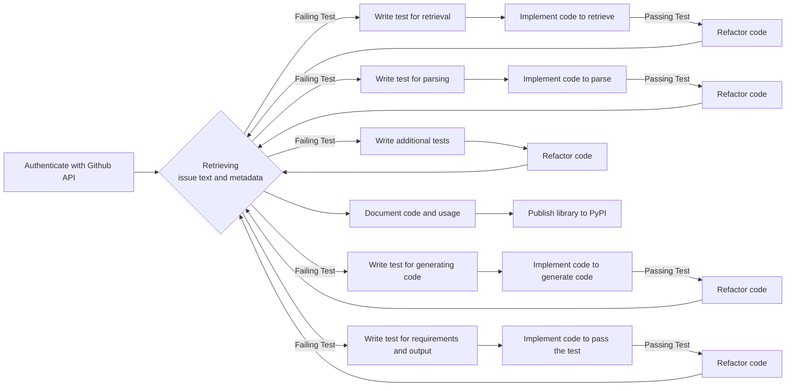

# Methodology of the code generation routine

This goal of this is to create multiple files of executable code from a single prompt.
The prompt is a string of text that describes the task to be performed.

You have to do it incrementally with an iterative set of prompts.
Basically pull up the chat gpt and enter prompts sequentially:

## Spec out the design

1. Describe the purpose of the code to be generated and the core tasks it accomplishes for users.
2. Describe the data models and methods required to accomplish the task
3. Describe the classes and services required to accomplish the task
4. Find samples from existing code base that would be useful in the implementation of this
4. Using Mermaid syntax create a UML diagram which represents the class members, attributes and methods, and additional information about them.

## Write the code
We would like to write tested, well documented code with examples that can be used to generate the code based on a Github issue.
What would be the set of steps we should use to do this?  Break the process down into atomic, small steps.  Describe the process in a mermaid diagram of a state-machine.

5. Write a test suite that tests the methods and classes
6. Write a example functions that document how the new methods are expected to be used.
7. Write a implementations of each of the functions in various files

# TDD Loop: Red-Green-Refactor
7. run test coverage to determine which lines of code are untested
1. Red
7. Write a test for the next method or class
7. Implement the methods and classes, creating files and code as needed

# TDD Loop

Authenticate with the Github API.
Write a failing test for retrieving the issue text and metadata from Github.
Implement the code to retrieve the issue text and metadata to make the test pass (Green).
Refactor the code to improve its design and maintainability.
Write a failing test for parsing the issue text to extract relevant information.
Implement the code to parse the issue text to make the test pass (Green).
Refactor the code to improve its design and maintainability.
Write a failing test for generating code based on the extracted information.
Implement the code to generate code based on the extracted information to make the test pass (Green).
Refactor the code to improve its design and maintainability.
Write a failing test for the generated code to meet the requirements and expected output.
Implement the code changes to pass the test (Green).
Refactor the code to improve its design and maintainability.
Write additional tests to cover edge cases and unexpected input.
Refactor the code to improve its design and maintainability.
Document the code and its usage.
Publish the library to PyPI.
Note that the steps may need to be revisited as new requirements or issues are discovered, or if tests fail during the process. The Red-Green-Refactor loop helps ensure that the code is tested thoroughly and meets the requirements before being released to the public.

Sean Kruzel
please write it as a mermaid diagram of a state-machine
Sure! Here's the same process using a state-machine diagram that incorporates Red-Green-Refactor loops for test-driven development:

mermaid
Copy code
graph LR
A[Authenticate with Github API]
A --> B{Retrieving issue text and metadata}
B -->|Failing Test| C[Write test for retrieval]
C --> D[Implement code to retrieve]
D -->|Passing Test| E[Refactor code]
E --> B
B -->|Failing Test| F[Write test for parsing]
F --> G[Implement code to parse]
G -->|Passing Test| H[Refactor code]
H --> B
B -->|Failing Test| I[Write test for generating code]
I --> J[Implement code to generate code]
J -->|Passing Test| K[Refactor code]
K --> B
B -->|Failing Test| L[Write test for requirements and output]
L --> M[Implement code to pass the test]
M -->|Passing Test| N[Refactor code]
N --> B
B -->|Failing Test| O[Write additional tests]
O --> P[Refactor code]
P --> B
B --> Q[Document code and usage]
Q --> R[Publish library to PyPI]
Note that the loop between steps B and E, B and H, B and K, B and N, and B and P represents the Red-Green-Refactor loop for each step. The loop allows for continuous improvement of the code based on testing and feedback.

Repo configured

Run specific environments (python or node) using docker (or docker-in-docker)

TDDCoder - Does Red-Green-Refactor Loops for specific functions

create branch

Brainstorm base case (input, output data), and corner cases (at least 2)

do:

For each example

Write failing test, runs to ensure compiles but fails

Write implementation, runs to ensure tests pass

Refactor files, runs to ensure tests pass

run complexity metrics

refactor slow tests

commit, fix any pre-commit hook errors, ensure tests pass

while test coverage < 80%, generate more examples

create pull request

Leader

Reads a github issue:

Design:

breaks the task down into higher level functions, plan the implementation using psudeo-code

Create a markdown of implementation details:

file organization

function signatures - descriptions, usage examples

Research: Look up relevant code from repo and organize into file signatures

Functions are name, args, kwargs: description, sentence describing usage

Redesign: repeat first step

Create DAG from AST of pseudo-code to track the implementation order

A server manages tasks

Delegates:

Sends tasks to the coder to implement

Generates task prompt

Reviews pull request if it completes task

Merges
