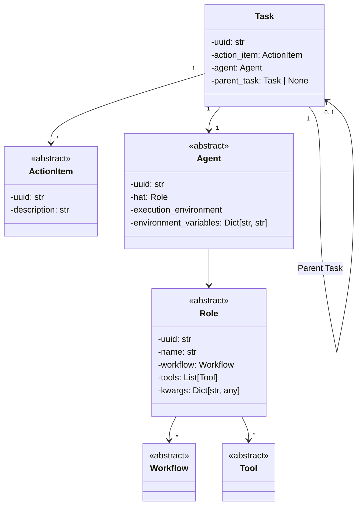

ManyHats: A Multi-Agent Task Management Framework
=====================================================

**ManyHats** is a framework designed to create a large team of agents that work together to accomplish various tasks. By delegating tasks to agents with appropriate workflows and tools, ManyHats helps you get things done efficiently.

# Key Concepts

* **Action Item**: A task sent to the ManyHats infrastructure that needs to be completed.
* **Agent**: An entity responsible for completing action items while assuming specific roles. Agents can evaluate, execute, and assess tasks in designated execution environments with specific permissions.
* **Role / 'Hat'**: A set of workflows and tools that an agent uses to complete an action item. Agents can wear multiple hats and switch between them. Role classes are named with the 'Hat' suffix, e.g., `SearchHat`, `CodingHat`.
* **Workflow**: A set of steps, functions, or state-machines associated with a role, used to complete tasks. Each role has its own unique workflows.
* **Tool**: External software, APIs, or services that a workflow uses to complete action items. Tool classes are named with the 'Tool' suffix, e.g., `GithubTool`, `GoogleSearchTool`. Tools can be utilized by multiple workflows.
* **Task**: A unit of work, consisting of an action item, an agent, and an optional parent task. Tasks are organized in a network called a Task-DAG (Directed Acyclic Graph).
Structure

A task is represented as a tuple:

```python
@dataclasses.dataclass
class ManyHatsTask:
    uuid: str
    action_item: str
    agent: Agent
    parent_task: str | None


task = ManyHatsTask()
```
An agent is defined as:

```python
@dataclasses.dataclass
class ManyHatsAgent:
    uuid: str
    hat: ManyHatsRole
    execution_environment: Any
    environment_variables: Dict[str, str]


agent = ManyHatsAgent()
```
A hat (role) consists of:

```python
@dataclasses.dataclass
class ManyHatsRole:
    uuid: str
    name: str
    workflow: ManyHatsWorkflow
    tools: List[ManyHatsTool]
    kwargs: Dict[str, Any]


hat = ManyHatsRole()
```




Next steps

1. Create the statemeachinCreate an agent class that can evaluate, execute, and assess tasks.
2. Move state-machines to a workflow class that can be used by an agent to complete tasks.
3. Create a tool class that can be used by a workflow to complete tasks.


## Examples

Create a trivia bot that can answer questions from a list of topics.

You can launch either a single agent via CLI

```bash
manyhats --hat trivia "What is the square root of the age of the President of France?"
```
This should
1. Launch create a new agent with a trivia hat.
2. Submit the question to the agent via a work-queue
3. The agent will evaluate the question and determine if it can answer it.


```python
from manyhats import ManyHatsAgent, ManyHatsRole, ManyHatsTask, ManyHatsWorkflow, ManyHatsTool


# DEPRECATED

## Services

 * Version Control:
   * local git:
   * Github CLI - used to create and edit repos within an organization or user account
 * Github Issue Tracker:
   * A local issue tracker - used to create and edit issues and organize them into projects
   * Linear.app API - used to create and edit issues and organize them into projects
 * Company Notes and plans:
   * Notion / Obsydian / Roam / Google Docs / Github Wiki / etc - used to create and edit notes and plans

## Workflow
A human triggers a new 'project' via CLI or creating a new 'milestone' in the issue tracker and tagging @manyhats

A milestone contains many projects, and a project contains many issues.  Issues can contain issues

Depending on the type of project, certain types of Agents will be spawned to monitor activity in the project and take actions to complete the project.

The general framework for an agent is

 * Thinking:
   * Understand the project and the issues and evaluates when the job is done.
   * Creates subtasks, with dependency graph and assigns them to other agents.
   * Commits changes to the appropriate github repos
 * Doing:
   * A worker that performs the tasks required to complete the task


When given a task, an agent evaluates the feasibility of the task, requests additional information, determines the acceptance criterion and plans subsequent steps and suggests the appropriate state-machines with initial conditions for each step.
Each task has:
 * Main Objective:
 * Relevant Context:
   * Local Context from parent and sibling tasks.
   * Global Context from the milestone, project and repository
 * Acceptance Criteria:
 * Examples:
 * State Machine Canidates:

    def evaluate_task(task):
        """
        Given a task, this function evaluates the feasibility of the task, requests additional information,
        determines the acceptance criterion, plans subsequent steps and suggests the appropriate state-machines
        with initial conditions for each step.

        vbnet
        Copy code
        Parameters:
        task (str): The task description provided to the agent.

        Returns:
        dict: A dictionary containing the feasibility, additional information required, acceptance criterion,
            planned steps, and suggested state-machines with initial conditions for each step.
        """

        # NOTE: This function is a placeholder and does not actually perform the described actions.
        # You would need to implement the actual logic or use a more advanced AI system to perform these tasks.
        # The function currently returns a static example response.

        response = {
            "feasibility": "To be determined",
            "additional_information": "Please provide more details about the task.",
            "acceptance_criterion": "Task should be completed within the given deadline and meet the specified requirements.",
            "planned_steps": [
                {
                    "step": "Step 1",
                    "state_machine": "StateMachine1",
                    "initial_conditions": "Initial conditions for Step 1",
                },
                {
                    "step": "Step 2",
                    "state_machine": "StateMachine2",
                    "initial_conditions": "Initial conditions for Step 2",
                },
            ],
        }

        return response

This is where AgentTDD comes into play.  It assembles tools and collects context and memories.  It determines if the task is completed.

1. evaluates the feasibility of the task

2. requests additional information and
3. plans steps and suggests next actions
4. updates global states and initial starting conditions and perhaps selects from various state machines based on the task at hand
    1. This is where AgentTDD comes into play
5. assembles tools and collects context and memories
6. Determines if the task is completed


# Basic Agents
 1. Test-Driven Development Agent
 2. Marketing Agent
 3. Sales Agent
 4. Customer Service Agent
 5. Project Management Agent
 6. CEO Agent
 7. DevOps Agent
 8. Frontend Agent
 8. Backend Agent

# Enterprise Features
 1. Subscibe to github or linear issues
 2. Run in a Docker container - pull from github
 3. Github Actions - run on a schedule or on a webhook

# Workflow

We are using Prefect as the orchestration and deployment model for these agents.

An Agent - can wear many hats and execute a variety of tasks.
 * Look at LangChain for inspiration on how to initialize an Agent with the same API
 * A potential task is a 'workflow' or a 'hat' that the agent can wear.

On initialization we ensure that each of the Agent's potential tasks, has the appropriate tools available to execute the task.

We can have many agents running.
Tools are prefect tasks since they need to have concurrency limits

Each Agent when executing a Tasks has the following phases:
 * Accepting - determines if the task is feasible and what additional information is required
   - if feasible, returns the task
   - if unclear, creates a subtask and assigns it to another agent who could provide more information (either the parent task or human input)
 * Doing - custom function or state machine
   - Executes the task via a custom function or state machine like (AgentTDD)
   - This could create additional subtasks
     - save the state of the task
     - update the Flow to include the new tasks
     - append current state to the conclusion of the new set of tasks (or determine if this task will automatically resume at the conclusion of the new set of tasks)
       - This final state skils the accepting and doing phases
 * Evaluating - determines if the task is complete and if not, what additional information is required
   - if complete, returns the properly formatted result
   - if failed, re-submits the tasks with the additional information on the failure
   - if crashes or timeout, re-try the task (prefect handles this)


We have a WorkQueue that is a Prefect Flow that is responsible for managing the tasks.


Each worker is a Prefect Task that is responsible for a single task.

We can have a single agent that is responsible for all the tasks, or we can have multiple agents that are responsible for different tasks.

How do you feed tasks to TaskManager?
    # * webhook (SLACK or generic API), directly as a string, ping (like call github issues api)
    # We have to complete tasks,
    # We have workflows to complete them and tools available to us to help us execute a workflow
