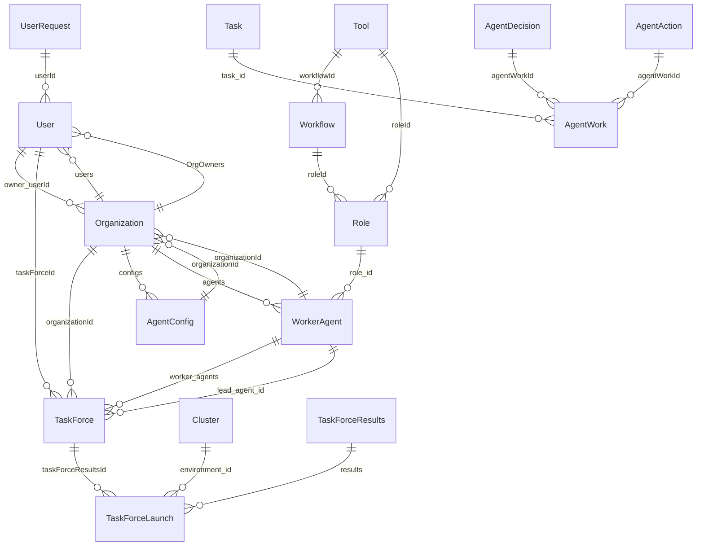

TaskForce CLI
=============

A user of the CLI is the current loggedin user.

For now lets assume that the authenication whomever is logged into the computer at the moment

1. User
1. Organization

For a given <org, user> run CRUD operations on the following:
1. Cluster
1. AgentConfig
1. Tool
1. TaskForce

1. WorkerAgent
1. Role
1. Workflow

<!-- Intermediate things
1. Task
1. AgentDecision
1. AgentAction
1. AgentWork -->

1. TaskForceResults

1. TaskForceLaunch

1. UserRequest

launch
status
stop
watch

We should be able to run these commands from anywhere in the terminal:

    tf login   # Authenticates the user and sets the current user as ~/.taskforce/current_user
    tf logout  # Removes the current user from ~/.taskforce/current_user
    tf whoami  # Prints the current user

    tf set org <org>  # Sets the current organization
    tf get org        # Gets the current organization

    tf org list  # Lists all organizations the user is a part of
    tf org <org>  # Shows an organization
    tf org create <org>  # Creates an organization
    tf org delete <org>  # Deletes an organization
    tf org invite <org> <user>  # Invites a user to an organization
    tf org kick <org> <user>  # Kicks a user from an organization
    tf org leave <org>  # Leaves an organization
    tf org users <org>  # Lists all users in an organization
    tf org owners <org>  # Lists all owners in an organization
    tf org add-owner <org> <user>  # Adds an owner to an organization
    tf org remove-owner <org> <user>  # Removes an owner from an organization

# Repeat for
    clusters, configs, tools, taskforces

    agents, roles, workflows

    tf create <task>  # Creates a task
    tf list           # Lists all tasks
    tf show <task>    # Shows a task
    tf edit <task>    # Edits a task
    tf delete <task>  # Deletes a task

    tf start <task>   # Starts a task
    tf stop <task>    # Stops a task
    tf done <task>    # Marks a task as done

    tf assign <task> <user>  # Assigns a task to a user
    tf unassign <task>       # Unassigns a task from a user

    tf comment <task> <comment>  # Adds a comment to a task
    tf comments <task>           # Lists all comments for a task

    tf search <query>  # Searches for tasks

    tf projects  # Lists all projects
    tf project <project>  # Shows a project
    tf project create <project>  # Creates a project
    tf project delete <project>  # Deletes a project
